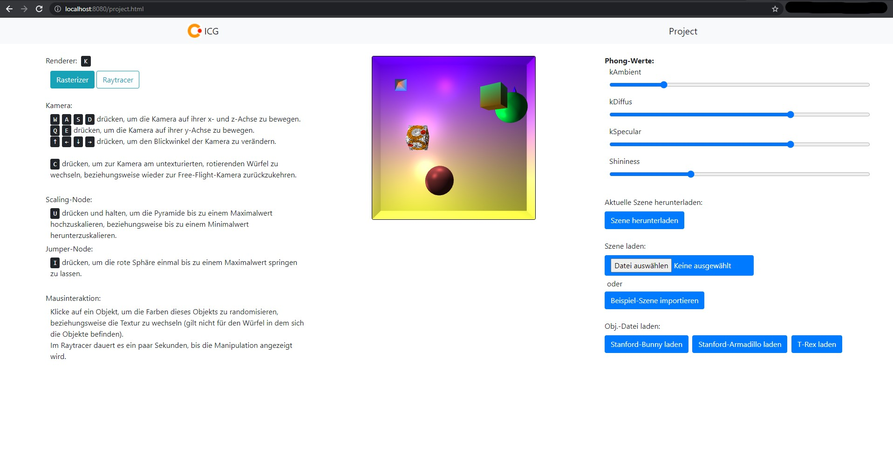

# Interactive computer graphics (ICG) project

*Read this in other languages: [English](/README.md), [Deutsch](/README-de.md)*

View the project demo: [https://monaroehm.github.io/interactive-computer-graphics/](https://monaroehm.github.io/interactive-computer-graphics/)



This repository includes my project for the lecture "interactive computer graphics" in 2021, my fourth semester at the Julius-Maximilians-Universität of Würzburg. It was created in collaboration with another student.

# My contributions

- Implementation of the [scene graph](src/project-boilerplate.ts#L133)
- Implementation of the [rasterizer](src/rasterization) and [ray tracer](src/raytracing)
- Three different renderable (raster) object shape classes: [Sphere](src/rasterization/objects/raster-sphere.ts), [Cube](src/rasterization/objects/raster-boxOutside.ts) and [Pyramid](src/rasterization/objects/raster-pyramid.ts)
- Functionality of multicolored objects (see [RasterPyramid](src/rasterization/objects/raster-pyramid.ts) for example)
- [Mathematical library](src/math) including algorithms for the [calculation of bounding boxes](src/math/ritterAlgorithm.ts) and [mouse interaction ray casting](src/math/rayTriangleIntersection.ts)
- Selection of objects in 3D space using the [mouse](src/project-boilerplate.ts#L752)
- Implementation of the phong shaders for [rasterizer](src/rasterization/shaders) and [ray tracer](src/raytracing/shaders/phong.ts)
- Functionality of textures (color and normal maps): [RasterTextureBox](src/rasterization/objects/raster-texture-box.ts), [suitable fragment shader](src/rasterization/shaders/texture-fragment-shader.glsl), [suitable vertex perspective shader](src/rasterization/shaders/texture-vertex-perspective-shader.glsl)
- Shading calculation with multiple moving light sources (see shaders)

# Project structure

```
.
├── README.md
├── dist
│   ├── obj <-- contains the .obj files that can be rendered with the UI buttons
│   │	└── ...
│   ├── sample_scene
│   │	└── sample_scene.json <-- the example scene that can be rendered with the "Beispiel-Szene importieren" button
│   ├── textures <-- contains the textures (color and normal maps)
│   │	└── ...
│   ├── ...
│   ├── index.html <-- the HTML of the project, other HTMLs can be ignored
│   └── ...
├── img <-- documentation
│   └── screenshot.jpg
├── src
│   ├── interfaces
│   │	├── rasterObject.ts
│   │	└── visitor.ts
│   ├── math <-- Mathe Bibliothek
│   │	├── intersection.ts
│   │	├── matrix.ts
│   │	├── quaternion.ts <-- not used in the final submission (only euler angles)
│   │	├── ray.ts
│   │	├── rayTriangleIntersection.ts <-- utils for ray-triangle intersection calculation
│   │	├── ritterAlgorithm.ts <-- utils for bounding sphere calculation
│   │	├── transformation.ts
│   │	└── vector.ts
│   ├── rasterization
│   │	├── objects
│   │	│   ├── ...
│   │	│   ├── raster-custom-shape.ts <-- for .objs
│   │	│   └── ...
│   │	├── shaders
│   │	│   └── ...
│   │	├── firstTraversalVisitorRaster.ts <-- does not render with traversal, only saves the positional data of camera and light
│   │	└── rastervisitor.ts <-- renders the raster objects
│   ├── raytracing
│   │	├── objects
│   │	│   └── sphere.ts
│   │	├── shaders
│   │	│   └── phong.ts
│   │	├── firstTraversalVisitorRay.ts <-- does not render with traversal, only saves the positional data of camera and light
│   │	└── rayvisitor.ts <-- renders the ray objects (only spheres)
│   ├── scene <-- defines the different types of nodes that can be put into the scenegraph
│   │	├── animation-nodes.ts
│   │	└── nodes.ts
│   ├── uebung <-- contains practice files of the lecture, can be ignored, not relevant to the final project
│   │	└── ...
│   ├── project-boilerplate.ts <-- Boilerplate: contains the relevant TypeScript code for index.html, contains the default scene graph and animation/render loops, saving/loading, .obj parsing and sets the functionality of the UI
│   ├── ...
└── ...

```

The project is thematically structured.
`dist` contains the distributed code like HTMLs, the `sample_scene`, `textures` and `obj`. `obj` contains example files for OBJs which can be loaded into the scene using our OBJ Loader. 
`img` contains a screenshot of the application, for documentary purposes.
`src` contains the source code:
- `interfaces` contains the interfaces of visitor and rasterObject.
- `math` mathematical library. Contains mathematical Objects like Vectors, but also algorithms for the calculation of intersections and bounding spheres.
- `rasterization` contains the raster objects, phong shaders and raster visitor.
- `raytracing` contains the ray tracing objects, phong shaders and ray visitor.
- `scene`  contains the scene data structure (nodes and animation nodes).
- `uebung` contains practice files from the lecture that are not relevant to the final project.
- `project-boilerplate.ts` contains the main logic like the scene graph, animation and render loop, saving and loading of scenes etc.

# Running the project locally

Execute this line in a CLI of choice in the directory of this file:

```
npm install
```

Then execute
```bash
npm start
```
and call the URL provided by the output, e.g. `localhost:<port>`, in a browser of choice.


# How-To

The functionality of the application is as follows:

## Renderer

Switch between the two types of renderers (rasterizer and ray tracer) using the K-key or the button provided by the UI.
The performance of the ray tracer is poor, since the calculation does not make use of the GPU in this project.

The ray tracer only renders spheres in this project.

## Camera

The camera starts in free flight mode, using WASD to move along the x- and z-axes and QE for the y-axis. The arrow keys can be used to adjust the pitch and yaw of the camera.

Press C to change to a static camera, placed on an animated rotation node. Pressing C again changes back to free flight mode.

## Lighting

The sliders on the right adjust the parameters of the phong shaders in both renderers.

## Animation nodes

There are three different animation nodes: Rotation, Jumper and Scaling.
Jumper and scaling can be controlled using the keyboard. 

Jumper: Press I to make the red sphere jump once.  
Scaling: Hold U to scale the pyramid up and down.

## Mouse interaction

Objects can be clicked in both render modes to change to a random color or texture. Though this might take some time in the ray tracer. The big cube that is viewed from the inside in the default position is not interactable in this way.

## Saving and loading a scene

The button "Szene herunterladen" on the right side saves all current information of the scene, i.e. color, position etc., in a .txt file in the JSON format. The information contained in this file can be loaded in via a file picker using the button below.

Alternatively, the provided sample_scene.json can be loaded in using the "Beispiel-Szene importieren" button.

## OBJ Loader

Three different example OBJ files can be loaded in using the buttons at the very bottom of the right side. The .obj files are parsed using our own algorithms. New OBJs will replace old ones in the scene.
